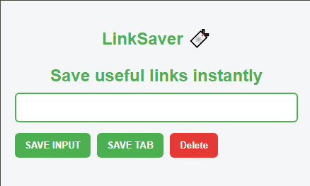

# LinkSaver Chrome Extension

A simple Chrome extension that helps users save useful links while browsing.

## Features

* Save links manually using the input field
* Save the current browser tab with one click
* Delete all saved links
* Data persistence using localStorage

## Tech Used

* HTML
* CSS
* JavaScript
* Chrome Extension API

## How it Works

1. User can enter a URL and click **SAVE INPUT**
2. User can click **SAVE TAB** to store the current browser tab
3. Links are stored in **localStorage**
4. Saved links are rendered as clickable items

## Preview

